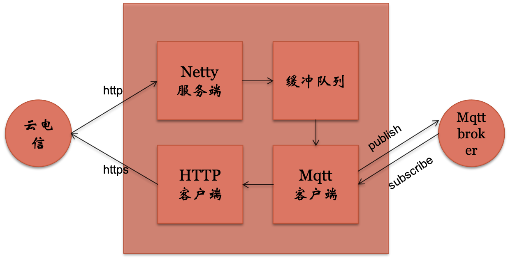

# 运营商北向应用-NBiot物联网平台

### 简介

随着5G、NBiot等技术的发展，运营商相继推出了自己的物联网平台，各运营商对设备的管理方式不同，想要完成设备与运营商云平台的对接需要详细了解其设备管理流程，对中小型用户的使用很不方便，并且云平台的北向数据是使用HTTP协议进行订阅推送的，用户必须搭建自己的Server来订阅设备端的数据。

基于此，本平台封装了运营商对设备管理的细节，用户仅使用MQTT轻量级协议订阅感兴趣的设备数据或进行指令下发，完成了运营商与用户之间的数据转发。

### 平台框架图

### 使用的技术

- netty: 基于Nio的java网络通信框架，适合用于开发高性能、高可靠性的服务端和客户端应用。

  本平台使用Netty构建http服务端，用于订阅运营商北向数据。

- MQTT：一种发布/订阅机制的轻量级应用层协议，特点：长连接，可支持一对多通信，相比http支持更多小型设备。这里使用的mqtt框架是eclipse-paho。
- Mysql：一种关系型数据库。用于存储运营商管理的设备信息。
- 多线程：这里使用java多线程+BlockingQueue实现生产-消费者模式的缓冲队列，以避免瞬时并发时的数据丢失情况。